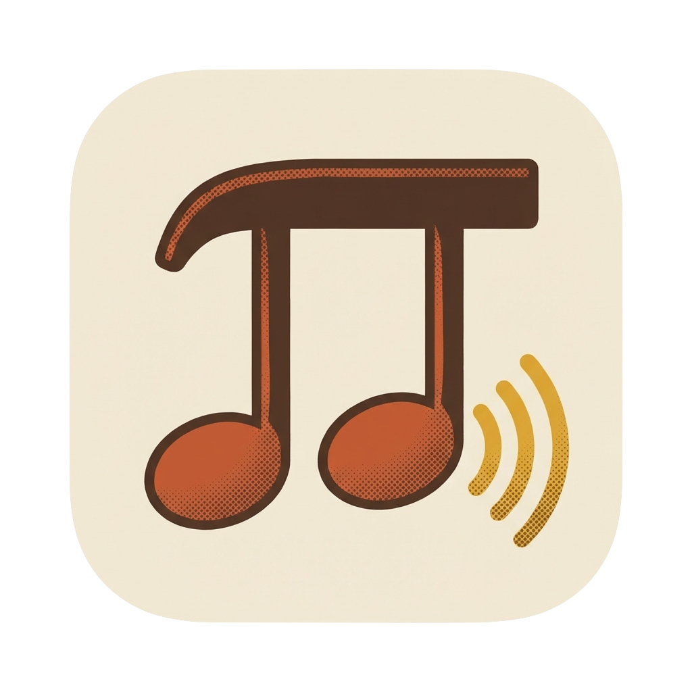
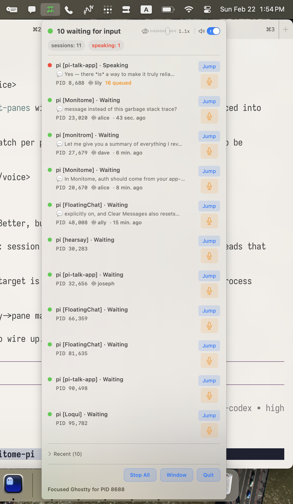
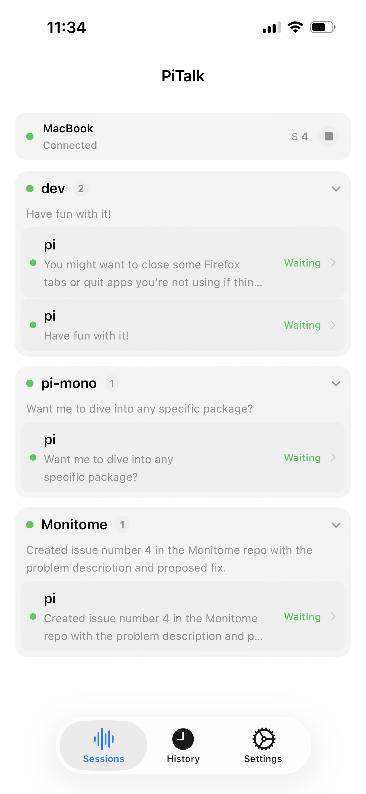

#  PiTalk

PiTalk is a macOS menu bar app that acts as a local voice hub.

It’s great with Pi, but it’s not Pi-only any app can send text to PiTalk’s local broker and have it spoken through the same centralized queue + playback system.

| PiTalk macOS menu bar app | PiTalk iOS companion app |
|---|---|
|  |  |

For the iPhone companion app docs, see:

- `apps/pitalk-ios/README.md`
- `apps/pitalk-ios/SETUP.md`

## Install with Homebrew

```bash
brew tap swairshah/tap
brew install --cask pitalk
```

Then launch PiTalk from Applications (or via Spotlight) and start sending broker requests.

## What this app does

- Runs a local speech broker on `127.0.0.1:18081` (NDJSON over TCP)
- Accepts `speak`, `health`, and `stop` commands from any local client
- Queues and coordinates playback so multiple sources can share one voice pipeline
- Streams low-latency TTS audio
- Supports cloud providers (ElevenLabs / Google) and optional on-device local TTS
- Shows live status in the menu bar
- Supports instant stop (including global **Cmd+.**)
- Keeps request history (queued / playing / played / interrupted / failed)
- Optional remote WebSocket control API for iOS/phone clients (`ws://<host>:18082/ws`)

## Use it as a voice hub (from any app)

Example broker call:

```bash
echo '{"type":"speak","text":"Hello from another app","sourceApp":"my-app","sessionId":"abc-123"}' | nc 127.0.0.1 18081
```

Health check:

```bash
echo '{"type":"health"}' | nc 127.0.0.1 18081
```

Stop all speech:

```bash
echo '{"type":"stop"}' | nc 127.0.0.1 18081
```

## Remote control API (WebSocket)

PiTalk also includes a WebSocket remote API intended for an iPhone companion app.

Default endpoint:

```text
ws://127.0.0.1:18082/ws
```

Use these env vars for tailnet exposure:

```bash
PITALK_REMOTE_BIND=0.0.0.0
PITALK_REMOTE_PORT=18082
PITALK_REMOTE_TOKEN=<strong-shared-token>
```

Dev-only no-token override:

```bash
PITALK_REMOTE_BIND=0.0.0.0
PITALK_REMOTE_PORT=18082
PITALK_REMOTE_ALLOW_INSECURE_NO_AUTH=1
```

Protocol docs:

- `docs/REMOTE_WS_PROTOCOL.md`
- `docs/IOS_REMOTE_PLAN.md`

## Pi-specific pieces in this repo

- **`Extensions/pi-talk`** — extracts `<voice>` tags from Pi responses and sends them to PiTalk
- **`Sources/PiTalk`** — menu bar app + broker + playback coordinator
- **`Sources/ptts`** — CLI client for enqueueing/stopping speech
- **`Sources/PiTalkClient`** — shared client helpers
- **`apps/pitalk-ios`** — iPhone companion app scaffold (WebSocket client + session UI)

## Quick start (dev)

```bash
./run-dev.sh
```

## Build app bundle

```bash
./scripts/build-app.sh
open .build/PiTalk.app
```

## Requirements

- macOS 13+
- `ffplay` for playback (`brew install ffmpeg`)
- For cloud mode: ElevenLabs API key (`ELEVEN_API_KEY` / `ELEVENLABS_API_KEY`) or Google TTS API key
- For local mode: `pocket-tts-cli` runtime plus model files (either bundled in full builds or downloaded on first use from the matching PiTalk GitHub release model asset)

## Acknowledgements

- Huge thanks to the **pi-statusbar** creator — the menu bar status UX was a big inspiration.
- In our Pi workflow, we use both the **pi-statusbar extension** and this repo’s **pi-talk extension** together.
